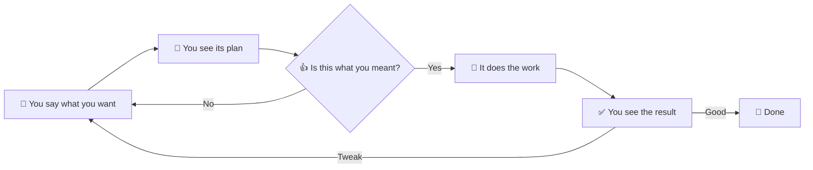

# Bamdra Loom

> Tell Loom what you want — its AI team builds it. You don't need to write or read any code.

## 🪡 What it really is

Loom isn't a code editor. It isn't a chatbot either.

Think of it as **a small AI team that lives in your computer**. You describe what you want. They argue about how to do it, write the code, review each other's work, and then show you the result. You only do two things — **say what you want** and **say yes or no**.

You never have to open code or learn jargon. If you're curious you can peek behind the curtain, but skipping it doesn't change anything.

## ✨ Who it's built for

These are the three kinds of people Loom serves best:

### 🔬 Researchers and analysts

You've got a folder of PDFs, web clippings, notes — and you want a **searchable, cross-referenced little tool** out of them. Or a spreadsheet you want crunched into a tidy chart page you can hand to a colleague.

Tell Loom: *"Take these 200 papers in this folder and turn them into a webpage I can filter by topic and search through."* Done.

### 🚀 People who want to build software but don't write code

You've had an idea sitting in your head — a tool, a small game, a personal site, an app for your friends. The "I can't code" wall is what stopped you.

Tell Loom: *"I want to make X. The feel I'm after is..."* It will ask you back about the parts that matter, work it out, build it, run it — and hand you something you can open in a browser or on your machine.

> 🌱 **Strong evidence**: This very tool was made that way. The author started from one sentence — *"I want a local desktop client for orchestrating multiple AI agents"* — never opened an editor, never read a line of generated code, and shipped version after version of the Loom you're using right now.

### 🛠️ Developers who want to stop hand-holding

You're already using AI to write code. But you're still copy-pasting long prompts, juggling context, eyeballing every diff yourself.

Hand the busywork to Loom. Say one sentence of intent; it runs the whole *analyze → plan → implement → review* loop internally. You only look at the result. Jump in whenever you want.

## 🎬 What 5 minutes feels like

1. Click "+" in the top bar, pick an empty directory (or an existing project — both work)
2. Type one sentence in the box at the bottom: *"I want a little webpage that logs my daily book quotes and auto-groups them by topic."*
3. Hit return. A plan appears on screen — its approach, the steps it'll take, the choices it sees
4. You don't have to follow the technical bits. **Just decide: is this the shape of what I wanted?** If yes, approve. If not, say *"I'd rather lean toward X."*
5. It starts working. Watch if you like, or grab a coffee
6. A few minutes later: *"Done — open this URL?"* You click and see it
7. Want changes? Tell it *"this button should be blue"* or *"add an export option."* It keeps going

## 🔁 The loop from your seat



You only appear at two spots in this loop: **saying what you want**, and **looking at what came out**. Everything in between — reading code, writing code, running tests, fixing bugs — is its job.

## 🖥️ After you install

- **macOS**: First launch says "unidentified developer." In Finder, **right-click → Open** once and confirm. macOS remembers.
- **Windows**: First launch may show SmartScreen — click "More info" → "Run anyway."
- **Linux**: Double-click the AppImage or install the deb.

<!-- screenshot: Loom main window after first launch -->

Once you're in, you'll see the main window with your project tree on the left, agent panels in the center, and the intent box at the bottom. Two ways to start working:

- **Full intent** — type what you want in the intent box and hit return. The team plans, builds, and delivers.
- **Quick Task** — click the ⚡ button in the action bar (or press `Cmd+Shift+E` / `Ctrl+Shift+E`) for small, one-off jobs that don't need a full plan. See the Quick Task guide for details.

If macOS says **"damaged"** instead of "unidentified," run this once in Terminal:

```
xattr -cr "/Applications/Bamdra Loom.app"
```

Then double-click again.
