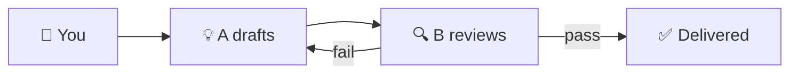
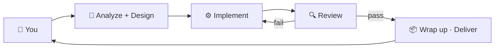

# 👥 Putting an AI team together

A single AI agent on its own tends to *come up with a plan, build it, and convince itself it's fine* — even when it's drifting off-course. Loom's trick isn't using a smarter agent; it's **letting a few of them keep each other honest**.

Three setups follow, scaled to how big the job is. You don't have to choose up front — start with the default, switch up only when you hit a wall.

## A capable assistant (solo)

Simplest setup: **one agent**.

It does everything — plans, builds, wraps up.

Good for:
- Tossing together a quick something
- A task with crisp boundaries and no real design choice
- You want the result fast and "good enough"

Like hiring **a generalist who can do a bit of everything** — cheap, fast, occasionally a little careless.

## A pair (paired)

**Two agents — one proposes, one reviews.**

A drafts the plan or writes the code → B reads it and says *"this part looks off because X"* → A revises → repeat until B signs off.

Good for:
- You don't want the first draft to wander
- You can wait a bit longer for a steadier result
- You're building something you'll **actually use for a while**, not throwaway

Like **two coworkers code-reviewing each other** — when one gets too confident, the other reels them in.

## A small team (orchestrated)

**Several agents, each owning a role**: one analyzes the problem, one designs, one implements, one reviews — sometimes a fifth keeps things consistent with the project's history.

They coordinate through files (you can see those files; you don't have to touch them).

Good for:
- A **somewhat complex project** — multiple parts, some data, real user interaction
- Something you want to keep iterating on for weeks
- You're willing to wait a little more up front in exchange for something maintainable

Like **a real little software team** — clear roles, each one focused.

## How to pick

| Your situation | Pick |
|---|---|
| Trying out an idea / one-off script / small tweak | **solo** (one assistant) |
| A small tool you'll actually use | **paired** (a duo) |
| A real little app, ongoing | **orchestrated** (a team) |

Just start with the default. If results feel "almost right but never quite," step up.

## How they avoid stepping on each other

Each agent writes what it did into a small set of fixed files — one for the plan, one for the task list, one for current progress. The next agent picks up by reading those files.

You can see those files in the tree, but **you really don't need to open them**. They're just the team's meeting notes.

## I changed something myself — how do they know?

If you went around the agents and edited the project yourself (changed a file, committed something on your own), hit the **Sync button** in the top bar. One agent will look at the current state and refresh the meeting notes. The team picks up next time knowing what you did.

---

## 🌐 Switching domains: Product vs Dev

At the top of the Agents panel you'll see two buttons: **Product** and **Dev**. This is the FlowDomain switch.

**Product** is for work that starts with a need and ends with something a person can see and touch — requirements, specs, wireframes, prototypes, design handoff.

**Dev** is for work that starts with a spec or a bug and ends with verified, running code — stack detection, implementation planning, code writing, test verification.

You can switch domains at any time. The switch is remembered across sessions.

When you switch, each agent role (Analysis, Design, Implement, Review) automatically shifts its focus:

| Role | Product mode | Dev mode |
|------|-------------|---------|
| **Analysis** | Clarify user goals, acceptance criteria, constraints | Triage request, identify affected modules, scope risk |
| **Design** | Spec, page flows, component structure, data model sketch | Implementation plan, file-level breakdown, interface contracts |
| **Implement** | Prototypes, HTML/CSS/JS, React components | Write or modify code, follow conventions, report changes |
| **Review** | Completeness, visual fidelity, interaction correctness | Correctness, style, edge cases, security rubric |

Most projects eventually use both — start in Product to figure out what to build, switch to Dev to actually build it.

