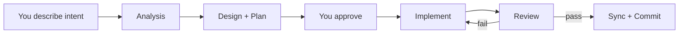

# 🌊 VibeFlow — how the team stays in sync

VibeFlow is the shared structure that keeps your AI team organized. Instead of agents losing context between rounds, they coordinate through four simple files — and a manifest that defines how they work together.

## The four coordination files

You'll see these in your project's `.vibeflow/` folder. You don't need to open or edit them — but knowing what they are helps you understand what the agents are doing.

### INSTRUCTIONS.md — the current to-do list

This is the execution sheet. It holds a checklist of tasks for the current round:

```markdown
- [ ] Add user login page
- [ ] Connect to database
- [x] Set up project structure
```

Tasks get checked off automatically as agents complete them. When you start a new round, the list refreshes.

### ARCH.md — the technical map

A living document that describes how the project is built — what modules exist, how they connect, what tech choices were made. Agents read this before making changes so they don't break things.

Updated automatically when changes affect the architecture.

### STATUS.md — where things stand

A snapshot of progress: what's done, what's in progress, what's next. Synced after each implementation round.

### Plan (solution-plan.md) — the design record

Before agents write code, they write a plan — what to change, why, and how. Plans are versioned, so you can see the history of design decisions.

## How a typical round works



1. You say what you want
2. The Analysis agent breaks it into requirements
3. The Design agent writes a plan
4. You review — approve or adjust
5. The Implement agent writes code
6. The Review agent checks the result
7. If it passes, files sync and a commit is created
8. If it fails, the Implement agent gets feedback and tries again (up to 2 rounds)

## You don't need to touch these files

The agents maintain all four coordination files themselves. Your job is just:

- **Say what you want** (intent)
- **Approve the plan** (or ask for changes)
- **Check the result** (does it work?)

If you edited something yourself and want agents to catch up, hit the **Sync** button in the top bar.
