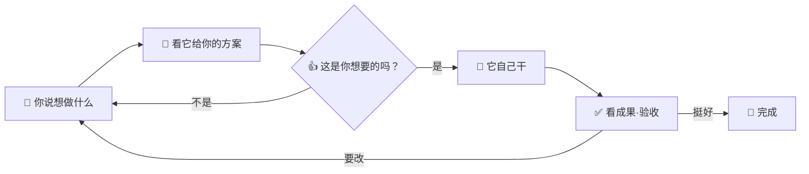

# Bamdra Loom

> 你说想做什么，它带着 AI 团队把它做出来——你不需要会写代码、也不需要看代码。

## 🪡 它是什么

Loom 不是一个"代码编辑器"，也不是一个"问答助手"。

它更像**你雇了一个小型 AI 团队，住在你电脑里**：你描述想做什么，他们之间分工讨论方案、写代码、互相评审、最后把成果跑给你看。你只做两件事——**说你想要什么** 和 **拍板要不要**。

整个过程你不用打开任何代码、不用懂任何技术名词。如果好奇可以打开看看，但跳过完全不影响。

## ✨ 它能帮谁做什么

下面三类人，是它最擅长服务的：

### 🔬 做研究的人

你手头有一堆 PDF、网页剪藏、调研笔记，想把它们变成**一个能搜索、能交叉引用的小工具**。或者你想把一份 Excel 跑一遍数据分析，最后输出几张图表网页给同事看。

跟 Loom 说："我想把这个目录里的 200 篇论文做成一个能按主题筛选、能全文搜的网页。"剩下的它来。

### 🚀 不会写代码、想做软件的人

你脑子里有一个产品——一个工具、一个小游戏、一个个人网站、一个能给朋友用的小应用。你之前因为"不会写代码"卡在那里。

跟 Loom 说："我想做一个 xxx，大概是这样的体验……"它会反问你细节，自己拆解、自己实现、自己跑通，最后给你一个能在浏览器或本地打开的产物。

> 🌱 **强证据**：这个工具就是这样诞生的——作者从一句"我想做一个本地多 agent 桌面客户端"开始，全程没有打开过编辑器、没有看过一行生成的代码，一个版本一个版本迭代到了你现在用的这个 Loom。

### 🛠️ 会写代码但想提效的开发者

你已经在用 AI 写代码，但还在手工"喂"长长的提示词、手工切换上下文、手工 review。

把这些繁活交给 Loom：你说一句意图，它内部自己跑"分析→方案→实现→评审"的闭环，你只看最后的成果。需要介入时随时介入。

## 🎬 大概是什么体验

5 分钟剧情：

1. 顶部「+」选一个空目录（或者一个已有的项目目录都行）
2. 在底部输入框写一句话："我想做一个能记录每天读书摘录、自动按主题归类的小网页"
3. 点回车，看屏幕上出现一份方案——里面写它打算用什么思路、分几步做、有哪些选择
4. 你看不懂细节没关系，**只判断"这是不是我想要的方向"**——是就点同意，不是就告诉它"我希望偏向 xxx"
5. 它开始自己干。你可以看着它工作，也可以去倒杯咖啡
6. 几分钟后，它告诉你："做好了，浏览器打开 xxx 看看？"——你点开看效果
7. 觉得哪里要改，跟它说"这个按钮换个颜色"或者"加一个导出功能"——它继续

## 🔁 你视角的闭环



整个圈里你只在两个位置出现：**说想法** 和 **看成果**。中间所有"读代码、写代码、跑测试、改 bug"都是它的事。

## 🖥️ 装好之后

- macOS 第一次打开会提示"未识别的开发者"——在 Finder 里**右键 → 打开**确认一次就好。系统会记住。
- Windows 第一次会弹 SmartScreen——点"更多信息"→"仍要运行"。
- Linux 直接双击 AppImage 或装 deb 包。

打开后，左边是项目文件树，中间是 agent 面板，底部是意图输入框。两种工作方式：

- **完整意图** — 在意图框里写你想做的，按回车。AI 团队会规划、实施、交付。
- **独立任务** — 点击操作栏的 ⚡ 按钮（或按 `Cmd+Shift+E` / `Ctrl+Shift+E`）处理不需要完整规划的小事。详见独立任务指南。

如果 macOS 提示"已损坏"（不是"未识别"），在终端跑一次：

```
xattr -cr "/Applications/Bamdra Loom.app"
```

然后双击就好。
