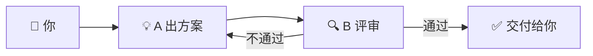
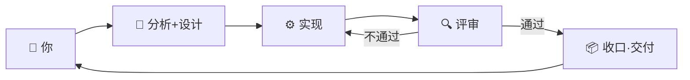

# 👥 让多个 AI 同事配合

一个 AI agent 单打独斗时，常常会"自己想方案、自己实现、自己觉得没问题"，结果偏到南辕北辙都没人提醒它。所以 Loom 的关键不是用一个更聪明的 agent，而是**让几个 agent 互相配合、互相挑刺**。

下面三种配合方式，对应任务大小不一样。你不需要选——刚开始默认就好，等你遇到瓶颈了再升级。

## 一个能干的助手（solo）

最简单的搭配：**只有一个 agent**。

它一个人把"想方案 + 写代码 + 收尾"全部做完。

适合：
- 你只是想随手做一个小东西
- 任务边界很清楚，没什么讨论空间
- 你想最快看到成果，对质量要求不高

像找一个**"什么都能干一点"的助手**——便宜、快，但偶尔会有想得不够细的时候。

## 一对搭档（paired）

**两个 agent，一个提议、一个评审**。

A 出方案/写代码 → B 看一遍说"这里我觉得不对，因为 xxx" → A 修改 → 直到 B 通过。

适合：
- 你不希望成果一上来就跑偏
- 你愿意多等一会儿换更稳的结果
- 你做的是会**用一段时间**的东西，不是一次性脚本

像**两个同事互相 code review**——一个人写得太自信时，另一个会拽住他。

## 一个小团队（orchestrated）

**多个 agent 各司其职**：一个分析问题、一个出设计、一个实现、一个评审，可能还有一个负责把成果跟之前的项目历史对齐。

它们之间通过文件协作（你能看到这些文件，但不需要改）。

适合：
- 你做的是一个**稍微复杂的项目**——多个模块、有数据存储、有用户交互
- 你希望它能跑很久——下次打开还能接着做
- 你愿意第一次稍微多等一会儿，换长期可维护

像**一个真正的小型软件团队**——分工明确，每个角色专注一件事。

## 怎么选

| 你的场景 | 推荐 |
|---|---|
| 想试个 idea / 一次性脚本 / 改个小东西 | **solo**（一个助手） |
| 做一个会用一段时间的小工具 | **paired**（一对搭档） |
| 做一个完整的小应用、长期迭代 | **orchestrated**（小团队） |

刚开始**直接用默认**就好。如果觉得"它做出来的东西总差点意思"，再升级到下一档。

## 它们之间怎么不打架

每个 agent 都把自己做的事写到固定的几个文件里——方案在一个文件、任务清单在一个、当前进度在一个。下一个 agent 接手的时候读这几份文件，就知道前面发生了什么。

你也能看这些文件（在文件树里），但**完全不需要打开**。它们就是 agent 之间的"会议纪要"。

## 我自己改了点东西，它们怎么知道

如果你绕过 agent 自己动了项目（比如自己改了一个文件、自己提交了什么），点 TopBar 上的**同步按钮**。一个 agent 会去看一眼当前现状，把"会议纪要"刷新一下。下次它们继续工作时就知道你做了什么。

---

## 🌐 切换工作域：Product vs Dev

在 Agents 面板顶部，你会看到两个按钮：**Product** 和 **Dev**。这就是工作域（FlowDomain）切换器。

**Product** 是面向需求和交付的域——从用户需求出发，产出规格文档、原型和设计交付物。

**Dev** 是面向代码实现的域——从需求或 bug 出发，产出经过验证的可运行代码。

你可以随时切换，切换状态会跨会话记忆。

切换后，每个角色（Analysis、Design、Implement、Review）的工作重心会自动调整：

| 角色 | Product 模式 | Dev 模式 |
|------|-------------|---------|
| **Analysis** | 梳理用户目标、验收标准、约束条件 | 分析请求、定位受影响模块、评估风险范围 |
| **Design** | 规格文档、页面流程、组件结构、数据模型草图 | 实现方案、文件级拆解、接口约定 |
| **Implement** | 原型、HTML/CSS/JS、React 组件 | 编写或修改代码、遵循项目规范、报告改动 |
| **Review** | 需求完整性、视觉还原度、交互正确性 | 代码正确性、风格、边界情况、安全检查 |

大多数项目两种域都会用到——先在 Product 域里想清楚要做什么，再切到 Dev 域真正去做。
