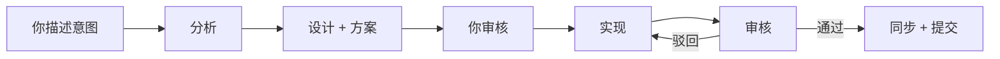

# 🌊 VibeFlow —— 团队如何保持同步

VibeFlow 是让 AI 团队保持有序的共享结构。agent 通过四个简单文件协调，manifest 定义协作方式。

## 四个协调文件

在项目的 `.vibeflow/` 文件夹中。你不需要编辑它们 —— 了解它们是什么就够了。

### INSTRUCTIONS.md —— 当前任务清单

执行单，包含本轮任务的清单：

```markdown
- [ ] 添加用户登录页面
- [ ] 连接数据库
- [x] 搭建项目结构
```

agent 完成后自动勾选。新一轮开始时列表刷新。

### ARCH.md —— 技术地图

描述项目如何构建 —— 有哪些模块、如何连接、做了什么技术选择。agent 改东西之前先读这个。

架构变更时自动更新。

### STATUS.md —— 当前进度

进度快照：已完成、进行中、下一步。每轮实施后自动同步。

### Plan (solution-plan.md) —— 设计记录

agent 写代码之前先写方案 —— 改什么、为什么、怎么改。方案有版本，你能看到设计决策的历史。

## 一轮的典型流程



1. 你说想要什么
2. 分析 agent 拆解需求
3. 设计 agent 写方案
4. 你审核 —— 同意或调整
5. 实现 agent 写代码
6. 审核 agent 检查结果
7. 通过就同步文件、自动 commit
8. 驳回就带反馈重来（最多 2 轮）

## 你不用碰这些文件

agent 自己维护。你只需要：说你想要什么、审核方案、检查结果。

自己改了东西想让 agent 跟上？点顶栏的 **Sync** 按钮。
